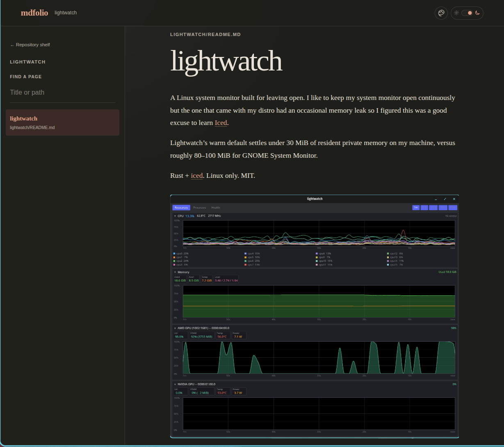

# mdfolio

`mdfolio` is a quiet local reader for the Markdown already in your
repositories. Point it at one repository to open its README, or at a directory
of repositories to browse them as a shelf.

It does not import, reorganize, or generate documentation. The filesystem is
the catalog.



## Install

Build and install the current checkout with Cargo:

```sh
cargo install --path .
```

The minimum supported Rust version is 1.88.

## Use

Run inside a repository:

```sh
mdfolio
```

Open a repository shelf:

```sh
mdfolio ~/projects
```

By default, `mdfolio` binds to an available loopback port and opens the browser.
Keep the browser closed or choose a stable port when needed:

```sh
mdfolio ~/projects --no-open
mdfolio ~/projects --port 4040
```

The server remains in the foreground until `Ctrl-C`.

## Appearance

Use the controls in the page header to choose a theme and switch between light
and dark modes. The built-in themes are:

- **Folio** — warm paper and umber;
- **Linen** — airy neutrals and cool blue;
- **Grove** — mineral and botanical tones;
- **Nocturne (dark)** — a dark-only indigo theme.

Theme and mode are remembered independently in browser storage. A dark-only
theme temporarily uses dark mode without changing the preferred mode that
returns with a light-and-dark theme. Before a mode is chosen explicitly,
`mdfolio` follows the operating-system preference.

Browser storage is scoped to the complete local address, including its port.
The default available port may change between launches; use a stable
`--port`, such as `--port 4040`, to keep one remembered appearance across
restarts.

## Reading model

- `.md` and `.markdown` files are discovered recursively and matched
  case-insensitively.
- Git boundaries group documents into repositories. One collection opens
  directly; multiple repositories or loose documents open the shelf.
- The selected directory is a strict library root. Running inside a repository
  subdirectory does not walk upward to import its parent `.git` or files; that
  subtree appears as one loose folio.
- A repository opens `README.md`, then a root `index.md`, then its shallowest
  alphabetical Markdown path. Matching is case-insensitive and deterministic.
- Repository-local `.gitignore`, `.git/info/exclude`, and `.ignore` files are
  honored. Common dependency and build caches are always excluded.
- Hidden authoring directories such as `.agents` remain visible unless ignored.
- Saving Markdown refreshes the affected reader. Navigation reloads only when
  the catalog changes; unrelated source builds and Git activity do not reload
  the page.
- The shelf and page list filter by repository name, title, and path. Press `/`
  outside a form field to focus the filter.

## Markdown and links

Rendering supports CommonMark and common GitHub-flavored features, including
tables, task lists, strikethrough, footnotes, description lists, heading
anchors, and server-side syntax highlighting.

Relative Markdown links resolve through the catalog. Extensionless links,
directory links, scan-root-relative links, and heading fragments are supported.
Relative images may use PNG, JPEG, GIF, SVG, WebP, or AVIF. PDF is the only
other local attachment type and is downloaded rather than embedded.

External HTTP(S) links and images and `mailto:` links are allowed.
`javascript:`, `file:`, `data:`, arbitrary local attachments, and MDX execution
are blocked.

## Local security boundary

`mdfolio` is read-only and binds only to `127.0.0.1`. Document routes require
catalog membership, asset paths are canonicalized beneath the selected root,
raw HTML is sanitized, SVG responses are sandboxed, and symlinked directories
are not scanned. An in-root symlinked image or PDF may be served; an out-of-root
target is rejected.

Paths containing invalid UTF-8 are skipped with a terminal warning because they
cannot have an unambiguous browser URL.

Markdown pages are limited to 16 MiB so concurrent browser requests have a
bounded rendering cost. Allowed images and PDFs are streamed in 64 KiB chunks
rather than loaded into memory as whole files.

## Development

```sh
cargo fmt -- --check
cargo test
cargo clippy --all-targets --all-features -- -D warnings
node --check assets/app.js
node --test assets/app.test.js
git diff --check
cargo build --release
```

The catalog in `src/catalog.rs` is the canonical data core. HTTP and rendering
code address documents by stable root-relative paths rather than scan-order
IDs. The watcher observes only ignore-aware directories and coalesces relevant
events before replacing the catalog.
